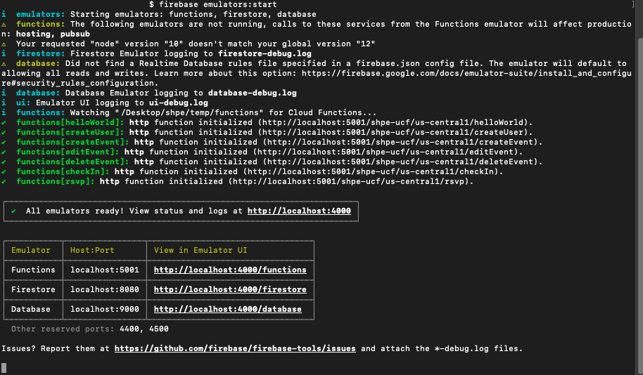

# SHPE @ UCF Back end Development

Open-source back end development for the SHPE UCF app and website.

## Contents
* [Environment setup](#environment-setup)
* [Contributing](#contributing)
* [About](#about)
* [Useful links](#useful-links)

## Environment setup
1. Clone the repository and navigate to the project.
	```
	git clone https://github.com/SHPEUCF/shpeucfbackend.git
	cd shpeucfbackend
	```
1. Navigate to the functions folder and install the modules used.
	```
	cd functions
	npm install
	```
1. Install the Firebase CLI (command line interface).
	```
	npm -g install firebase-tools
	```
1. Authorize the Firebase CLI.
	```
	firebase login
	```
	Your command line should give you a URL to sign in to your firebase console. Copy and paste the URL into your browser and sign in with the browser. *Ask the tech directors for the login information*.

	<p align="center">
		
	</p>

	Once you sign in successfully, you will get to a "Firebase CLI Login Successful" page. Woot woot! :tada:
1. Next, cd into the `functions` folder and run the following command to start your firebase emulator:
	```
	npm run serve
	// shortcut for `npm run build && firebase emulators:start`
	```
	This will, in turn, run:
	* `npm run build`: compiles the functions in the code to work with the emulator. It must be run after any changes to the code if you want those changes to be reflected on the emulator
	* `firebase emulators:start`: starts the local emulator for firebase used to test the firestore
	After, you can view the status on your localhost.
	<p align="center">
		
	</p>

## Contributing
For contributing to this project, please check out [contributing](.github/CONTRIBUTING.md), where you will find how to work with Git, handle branches, and pull requests.

## About
**Built with**
* [Firestore](https://firebase.google.com/docs/firestore/)
* [Node](https://nodejs.org/en/)

**License**  
This project is licensed under the MIT License. See [LICENSE](LICENSE) for details.

## Useful links
* [Firestore Admin documentation](https://firebase.google.com/docs/reference/admin/node/admin.firestore)
